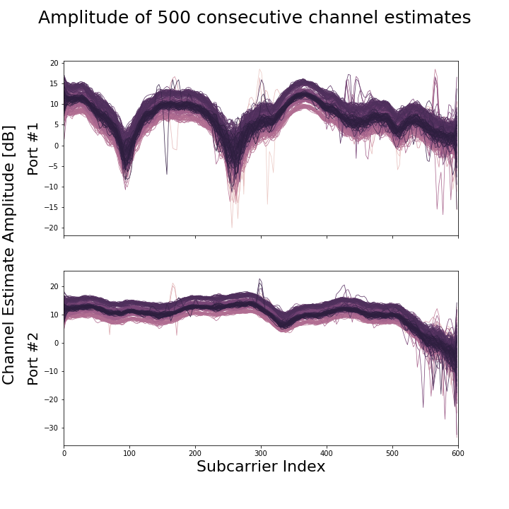
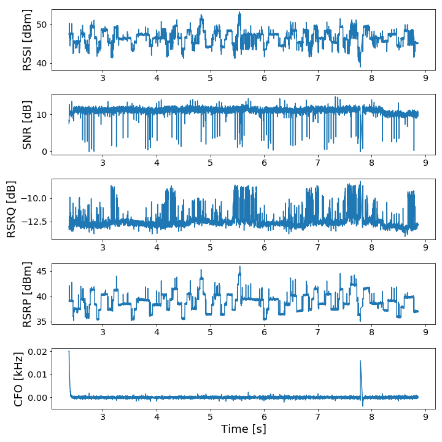

srsLTE
=====

Fork of the [srsLTE software](https://github.com/srsLTE/srsLTE) slightly modified to extract the *channel estimate* (i.e. the **Channel State Information** (CSI)), as well as other features (RSSI, RSRQ, ...)

---

# How to install

Tried with Ubuntu 18.04 and CMake 3.5.1

- Disable CPU frequency scaling:

```
for f in /sys/devices/system/cpu/cpu[0-9]*/cpufreq/scaling_governor ; do
	echo performance > $f
done
```

> Not disabling CPU frequency scaling might lead to performance issues

- Install **USRP Hardward Driver** (UHD):

> Ubuntu 18.04 has access to outdated UHD drivers. Hence we need to use the official PPA by Ettus Research (the company making USRP).

```
sudo apt-get remove -y uhd
sudo apt-get remove libuhd-dev libuhd003 uhd-host -y
sudo apt-add-repository --remove "deb http://files.ettus.com/binaries/uhd/repo/uhd/ubuntu/trusty trusty main"
sudo add-apt-repository ppa:ettusresearch/uhd -y
sudo apt-get update
sudo apt-get -y --allow-unauthenticated install python python-tk libboost-all-dev libusb-1.0-0-dev
sudo apt-get -y --allow-unauthenticated install libuhd-dev libuhd003 uhd-host
```

- Install the required packages for this fork of `srsLTE`:

```
sudo apt-get install cmake libfftw3-dev libmbedtls-dev libboost-program-options-dev libconfig++-dev libsctp-dev
```

- Download, build and install this fork of `srsLTE`:

```
git clone https://github.com/arthurgassner/srsLTE.git
cd srsLTE-modified
mkdir build
cd build
cmake ../
make
make test
sudo make install
sudo ldconfig
```

---
# How to setup 

- Edit the configuration file governing the connection to eNodeBs (i.e. `srsue/ue.conf`) so that you can connect to the eNodeB you wish to connect to 
> Typically, you just have to change the field `dl_earfcn`

---
# How to run

- Connect the **Software-Defined Radio** (in our case the [USRP B200mini](https://www.ettus.com/all-products/usrp-b200mini/)) by USB 3.0 to the computer running the srsLTE-modified software
> Using USB 2.0 might cause speed issues, so don't do that

- Connect the **PC/SC reader** (in our case the [HID OMNIKEY 3121](https://www.hidglobal.com/products/readers/omnikey/3121)) by USB to the computer running the srsLTE-modified software
> - To install a smartcard on Linux, simply run `sudo apt install pcscd` (follow [this](http://wiki.infonotary.com/index.php/Installation_of_smart_card_reader_and_smart_card_drivers_in_Linux) if you run into issues)
> - To make sure that the PC/SC reader is recognized, run `pcsc_scan`. To install it, run `sudo apt install pcsc-tools`

- Plug in the **SIM card** (with [PIN deactivated](https://support.myxplora.com/hc/en-gb/articles/360003363353-How-to-deactivate-the-PIN-code-of-your-SIM-card)) in the PC/SC reader
> It has to be a SIM card allowing you to connect to the eNodeB that you want to connect to. If you're unsure of whether you can connect to the expected eNodeB, first try with a phone.

- Go to `srsue/` and run
	```
	sudo srsue ue.conf
	```


> The first time running the above command, you might be prompted to run `sudo /usr/lib/uhd/utils/uhd_images_downloader.py` to download packages required to connect to the USRP Software-Defined Radio.

---

## Explanation

- The `ce` array (located in `srsLTE/lib/src/phy/ch_estimation/chest_dl.c`) should contain the channel estimate (i.e. the CSI).
	- The function `srslte_chest_dl_estimate_cfg(...)` is called by the function `estimate_pdcch_pcfich(...)` (located in `lib/src/phy/ue/ue_dl.c`). According to *Innovations, Telesystem. ”LTE in a Nutshell.” White paper (2010). pp.11-12*, channel estimation is performed in the **PDCCH** (Physical Downlink Control Channel), which supports the idea that `ce` contains the channel estimate.

	- The `ce` array is a 3D array of complex floats of dimension (#ports) x (#Rx antennas) x (#subcarriers).

	- It seems that `ce` contains the channel estimates for *all* subcarriers, not just the ones carrying *Cell-Specific Reference Signals* (CRS). The channel estimate of non-CRS-carrying subcarriers is estimated through interpolation of the channel estimates of CRS-carrying subcarriers. This is supported by the comment at the head of the `chest_dl.c` file:
	> Estimates the channel in the resource elements transmitting references and interpolates for the rest of the resource grid

	- The `ce` array can be saved to a file by modifying the `estimate_pdcch_pcfich(...)` function. This function is called every ms. Below is a plot of its amplitude over each subcarrier. The shape and overall aspect is in concordance with what can be seen in CSI-related papers for WiFi.

	


## Other features (RSSI, RSRQ, SNR, ...)

- We can exploit the function `estimate_pdcch_pcfich(...)` (located in `lib/src/phy/ue/ue_dl.c`). It calls `srslte_chest_dl_estimate_cfg(...)` and populate a `srslte_chest_dl_res_t` `struct`. This `struct` contains the RSSI, RSRQ, RSRP, SNR, CFO for the currently connected eNodeB. We can save the content of that `struct` from there. Below is a picture of those measurements through time.

	

---

# Common issues

- Running `make` when building `srsLTE-modified` might give you the following error:

```
[ 52%] Linking CXX executable pss_usrp
//usr/lib/x86_64-linux-gnu/libSM.so.6: undefined reference to `uuid_unparse_lower@UUID_1.0'
//usr/lib/x86_64-linux-gnu/libSM.so.6: undefined reference to `uuid_generate@UUID_1.0'
collect2: error: ld returned 1 exit status
lib/src/phy/sync/test/CMakeFiles/pss_usrp.dir/build.make:102: recipe for target 'lib/src/phy/sync/test/pss_usrp' failed
make[2]: *** [lib/src/phy/sync/test/pss_usrp] Error 1
CMakeFiles/Makefile2:3830: recipe for target 'lib/src/phy/sync/test/CMakeFiles/pss_usrp.dir/all' failed
make[1]: *** [lib/src/phy/sync/test/CMakeFiles/pss_usrp.dir/all] Error 2
Makefile:160: recipe for target 'all' failed
make: *** [all] Error 2
```

To fix it, follow [these instructions](https://github.com/piyushrpt/condaLinuxSetup/blob/master/issues.md).
